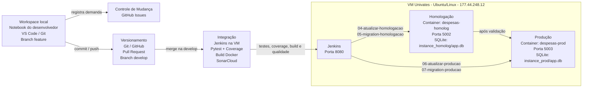

# Registro de Despesas e Receitas

Aplicação web simples para registro, acompanhamento e controle de despesas e receitas, desenvolvida em Python com Flask e banco SQLite.

O projeto também contempla um fluxo de Gerência de Configuração de Software com ambientes de **Integração**, **Homologação** e **Produção**, utilizando GitHub, Jenkins, Docker, testes automatizados, análise de qualidade de código e versionamento de banco de dados.

---
## Diagrama da arquitetura configurada




### Tecnologias representadas no diagrama

| Área | Tecnologia/Ferramenta |
|---|---|
| Ambiente | VM Univates com Ubuntu/Linux |
| Contêineres | Docker e Docker Compose |
| Linguagem | Python 3 |
| Framework | Flask |
| Banco de dados | SQLite |
| Controle de mudança | GitHub Issues |
| Versionamento | Git e GitHub |
| Revisão/integração de mudanças | Pull Request |
| Integração | Jenkins |
| Testes automatizados | Pytest |
| Estatísticas/cobertura | Coverage / pytest-cov |
| Qualidade de código | SonarCloud |
| Ambientes | Homologação na porta 5002 e Produção na porta 5003 |
| Versionamento do banco | Migrations SQL e tabela `schema_migrations` |

---

## Links principais

- **Repositório:** https://github.com/luissauthier/despesas-receitas
- **Jenkins:** `http://177.44.248.12:8080`
- **Homologação:** `http://177.44.248.12:5002`
- **Produção:** `http://177.44.248.12:5003`

### Credenciais iniciais

- **Usuário:** `admin`
- **Senha:** `admin123`

---

## Stack da aplicação

| Finalidade | Tecnologia |
|---|---|
| Linguagem | Python 3 |
| Framework web | Flask |
| Banco de dados | SQLite |
| ORM | SQLAlchemy / Flask-SQLAlchemy |
| Templates | HTML/Jinja |
| Geração de PDF | ReportLab |
| Testes | Pytest |
| Cobertura | Coverage / pytest-cov |
| Contêineres | Docker / Docker Compose |
| CI/CD | Jenkins |
| Versionamento | Git / GitHub |
| Qualidade de código | SonarCloud |
| Controle de mudança | GitHub Issues |

---

## Funcionalidades

- Login e logout;
- Cadastro, edição, exclusão e listagem de lançamentos;
- Classificação por tipo: `RECEITA` ou `DESPESA`;
- Classificação por situação: `PAGO` ou `EM_ABERTO`;
- Filtros por texto, data, tipo e situação;
- KPIs de ganhos, gastos e saldo;
- Exportação de relatório em PDF;
- Envio de relatório por e-mail;
- Notificações por e-mail;
- Separação entre ambientes de Homologação e Produção;
- Migrations versionadas para atualização incremental do banco de dados.

---

## Estrutura do projeto

```text
despesas-receitas/
├── app/
│   ├── app.py
│   ├── models.py
│   ├── email_service.py
│   ├── pdf_export.py
│   ├── lancamentos_filters.py
│   ├── seed.sql
│   └── templates/
├── instance/
├── instance_homolog/
├── instance_prod/
├── migrations/
├── scripts/
├── tests/
├── Dockerfile
├── docker-compose.yml
├── requirements.txt
├── pytest.ini
├── run.py
└── sonar-project.properties
```

---

## Banco de dados

O projeto utiliza SQLite.

### Tabela `usuario`

| Campo | Tipo | Descrição |
|---|---|---|
| `id` | INTEGER | Chave primária |
| `nome` | VARCHAR | Nome do usuário |
| `login` | VARCHAR | Login único |
| `email` | VARCHAR | E-mail do usuário |
| `senha` | VARCHAR | Senha |
| `situacao` | VARCHAR | Situação do usuário |

### Tabela `lancamento`

| Campo | Tipo | Descrição |
|---|---|---|
| `id` | INTEGER | Chave primária |
| `descricao` | TEXT/VARCHAR | Descrição |
| `data_lancamento` | DATE | Data |
| `valor` | NUMERIC(12,2) | Valor |
| `tipo_lancamento` | VARCHAR | `RECEITA` ou `DESPESA` |
| `situacao` | VARCHAR | `PAGO` ou `EM_ABERTO` |

### Carga inicial

A carga inicial está em:

```text
app/seed.sql
```

Ela cria:

- 1 usuário inicial: `admin` / `admin123`;
- Lançamentos iniciais para demonstração.

O seed só é executado quando não existem lançamentos cadastrados, evitando recriação ou perda de dados em atualizações.

---

## Versionamento do banco de dados

As alterações de banco são controladas por migrations SQL na pasta:

```text
migrations/
```

Cada ambiente possui uma tabela de controle chamada:

```text
schema_migrations
```

Essa tabela registra quais migrations já foram aplicadas em cada banco.

### Ambientes e bancos

| Ambiente | Banco |
|---|---|
| Local | `instance/app.db` |
| Homologação | `instance_homolog/app.db` |
| Produção | `instance_prod/app.db` |

### Exemplo de migration usada na apresentação

Arquivo:

```text
migrations/004_cria_tabela_categoria.sql
```

Conteúdo:

```sql
CREATE TABLE IF NOT EXISTS categoria (
    id INTEGER PRIMARY KEY,
    descricao TEXT NOT NULL UNIQUE
);

INSERT OR IGNORE INTO categoria (id, descricao) VALUES
    (1, 'Alimentação'),
    (2, 'Transporte'),
    (3, 'Lazer');
```

---

## Como rodar localmente

### Windows / PowerShell

```powershell
cd .\despesas-receitas
python -m venv .venv
.\.venv\Scripts\Activate.ps1
pip install -r requirements.txt
python run.py
```

Acessar:

```text
http://localhost:5000/lancamentos
```

### Linux

```bash
cd despesas-receitas
python3 -m venv .venv
source .venv/bin/activate
pip install -r requirements.txt
python run.py
```

Acessar:

```text
http://localhost:5000/lancamentos
```

---

## Testes automatizados

A suíte de testes utiliza Pytest.

Executar testes:

```bash
pytest
```

Executar com detalhes:

```bash
pytest -v
```

Executar com cobertura:

```bash
pytest --cov=app
```

Os testes cobrem:

- Rotas HTTP;
- Autenticação;
- CRUD de lançamentos;
- Validação de formulários;
- Modelos;
- Filtros e KPIs;
- Exportação PDF;
- Integrações de e-mail com mocks.

---

## Docker

A aplicação roda em contêineres Docker para os ambientes de Homologação e Produção.

### Ambientes

| Ambiente | Container | URL |
|---|---|---|
| Homologação | `despesas-homolog` | `http://177.44.248.12:5002` |
| Produção | `despesas-prod` | `http://177.44.248.12:5003` |

---

## Jenkins

O Jenkins é responsável pelo processo semi-automatizado de CI/CD.

URL:

```text
http://177.44.248.12:8080
```

### Jobs configurados

| Job | Função |
|---|---|
| `01-criar-homologacao` | Cria o ambiente de Homologação |
| `02-criar-producao` | Cria o ambiente de Produção |
| `03-rodar-integracao` | Executa testes, cobertura, build e análise de qualidade |
| `04-atualizar-homologacao` | Atualiza a aplicação em Homologação |
| `05-migration-homologacao` | Aplica migrations em Homologação |
| `06-atualizar-producao` | Atualiza a aplicação em Produção |
| `07-migration-producao` | Aplica migrations em Produção |

---

## Fluxo de Gerência de Configuração

```text
Registro da mudança
   ↓
Implementação local
   ↓
Commit, push e Pull Request
   ↓
Merge na develop
   ↓
Integração no Jenkins
   ↓
Atualização de Homologação
   ↓
Validação da aplicação e do banco
   ↓
Atualização de Produção
   ↓
Validação final
```

### Etapas atendidas

| Etapa | Ferramenta |
|---|---|
| Registro da mudança | GitHub Issues |
| Implementação | VS Code / Git / SQL |
| Versionamento | Git / GitHub |
| Testes automatizados | Pytest |
| Estatísticas e cobertura | Coverage / pytest-cov |
| Qualidade de código | SonarCloud |
| Build | Docker |
| Homologação | Jenkins + Docker |
| Produção | Jenkins + Docker |
| Versionamento do banco | Migrations SQL + `schema_migrations` |

---

## Scripts de apoio na VM

### Limpar ambiente antes da apresentação

```bash
/home/univates/limpar-vm-apresentacao.sh
```

Esse script remove containers, imagens, volumes e cache Docker da aplicação.

### Preparar VM

```bash
/home/univates/preparar-vm-apresentacao.sh
```

Esse script instala ou valida as ferramentas necessárias, clona ou atualiza o projeto, ajusta permissões e reinicia Docker/Jenkins.

---

## Roteiro resumido da apresentação

### 1. Limpar VM

```bash
/home/univates/limpar-vm-apresentacao.sh
```

### 2. Preparar VM

```bash
/home/univates/preparar-vm-apresentacao.sh
```

### 3. Criar ambientes

No Jenkins:

```text
01-criar-homologacao
02-criar-producao
```

Validar:

```text
http://177.44.248.12:5002
http://177.44.248.12:5003
```

### 4. Registrar mudança

Criar issue no GitHub:

```text
Alterar texto da aplicação e criar tabela categoria
```

### 5. Implementar localmente

Criar branch:

```bash
git checkout develop
git pull origin develop
git checkout -b feature/categoria-migration
```

Criar migration:

```text
migrations/004_cria_tabela_categoria.sql
```

Alterar um texto visível da aplicação.

### 6. Versionar

```bash
git add .
git commit -m "Altera texto e adiciona tabela categoria"
git push -u origin feature/categoria-migration
```

Criar Pull Request para `develop` e realizar o merge.

### 7. Integrar

No Jenkins:

```text
03-rodar-integracao
```

### 8. Atualizar Homologação

No Jenkins:

```text
04-atualizar-homologacao
05-migration-homologacao
```

Validar banco:

```bash
cd ~/despesas-receitas

sqlite3 ./instance_homolog/app.db ".tables"
sqlite3 ./instance_homolog/app.db "SELECT * FROM categoria;"
sqlite3 ./instance_homolog/app.db "SELECT filename FROM schema_migrations ORDER BY filename;"
sqlite3 ./instance_homolog/app.db "SELECT COUNT(*) FROM lancamento;"
```

### 9. Atualizar Produção

No Jenkins:

```text
06-atualizar-producao
07-migration-producao
```

Validar banco:

```bash
cd ~/despesas-receitas

sqlite3 ./instance_prod/app.db ".tables"
sqlite3 ./instance_prod/app.db "SELECT * FROM categoria;"
sqlite3 ./instance_prod/app.db "SELECT filename FROM schema_migrations ORDER BY filename;"
sqlite3 ./instance_prod/app.db "SELECT COUNT(*) FROM lancamento;"
```

---

## Conclusão

Este projeto demonstra um fluxo completo de Gerência de Configuração de Software, com controle de mudança, versionamento, testes automatizados, análise de qualidade, build, criação de ambientes, atualização controlada de Homologação e Produção e versionamento incremental do banco de dados.

A atualização do banco é feita por migrations, preservando os dados existentes em cada ambiente.
